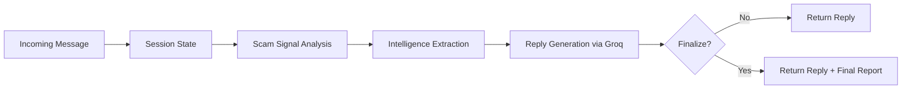

<p align="center">
  
  
</p>

<h1 align="center">🛡️ NIRIKSHA.ai</h1>
<h3 align="center">Agentic Honeypot for Scam Detection and Intelligence Extraction</h3>

<p align="center">
  <b>An autonomous, multi-turn AI honeypot that chats like a real person, keeps scammers engaged, and quietly collects actionable scam intelligence.</b>
</p>

<p align="center">
  
  
  
  
</p>

---

## ⚡ Quickstart for the Evaluator

| Detail | Value |
|---|---|
| **Endpoint** | `POST /api/detect` |
| **Success Response** | HTTP `200` with JSON `{ "status": "success", "reply": "..." }` |
| **Reply Field Priority** | `reply` > `message` > `text` |
| **Max Response Time** | 30 seconds |

**Live Endpoint (Railway):**

```
https://agentichoneypot-production-12fb.up.railway.app/api/detect
```

---

## 📑 Table of Contents

- [What is NIRIKSHA.ai?](#-what-is-nirikshaai)
- [What It Does](#-what-it-does)
- [How It Works](#-how-it-works)
- [API Reference](#-api-reference)
- [Final Output Report](#-final-output-report)
- [Repo Structure](#-repo-structure)
- [Setup and Run Locally](#-setup-and-run-locally)
- [Testing](#-testing)
- [Deployment Notes](#-deployment-notes)
- [Example Scam Types](#-example-scam-types)
- [Team](#-team)
- [License](#-license)

---

## 🔍 What is NIRIKSHA.ai?

NIRIKSHA.ai is an **agentic honeypot** that pretends to be a normal person when a scammer sends a message.

Most systems block scammers quickly. That stops one attempt, but it rarely helps you learn anything about who is behind it. NIRIKSHA.ai takes a different approach:

- **Keeps the scammer talking** using believable, human-like replies.
- **Quietly extracts details** that scammers tend to reveal when they think a victim is cooperating.
- **Produces a clean, structured report** at the end of a session so the data can be used for further analysis.

> The scammer should never feel like they are talking to a bot, and the system never reveals that it is analyzing them.

---

## 🚀 What It Does

### 1. Engages Scammers Across Multiple Turns

NIRIKSHA.ai responds like a cautious, slightly confused person. This persona works well because scammers stay invested when they believe a victim is willing to follow instructions.

Replies are generated using:

- **Groq** inference engine
- **Meta Llama 3.3 70B** (`llama-3.3-70b-versatile` by default)

### 2. Detects Scam Intent Using Generic Signals

Detection is not based on one fixed script. The system looks for common scam behaviors and patterns such as:

| Signal Category | Examples |
|---|---|
| Urgency and threats | "blocked", "suspended", "final warning", "immediately" |
| Credential theft | "share OTP", "PIN", "CVV", "password" |
| Payment pressure | "pay", "transfer", "send" |
| Suspicious artifacts | UPI IDs, phone numbers, URLs, bank account numbers |

### 3. Extracts Intelligence Silently

Extraction runs on the full conversation (history + latest message). Results are deduplicated and normalized.

**Extracted fields:**

| Field | Description |
|---|---|
| `phoneNumbers` | Phone numbers mentioned by the scammer |
| `bankAccounts` | Bank account numbers |
| `upiIds` | UPI payment identifiers |
| `phishingLinks` | Suspicious or phishing URLs |
| `emailAddresses` | Email addresses shared |
| `caseIds` | Fake case or complaint IDs |
| `policyNumbers` | Insurance or policy numbers |
| `orderNumbers` | Order reference numbers |
| `referenceIds` | Any other reference identifiers |

### 4. Stays Safe and Believable

- Never shares OTP, PIN, CVV, or password.
- Avoids words that break the illusion (`scam`, `fraud`, `AI`, `bot`, `honeypot`).
- Keeps replies short, usually 1 to 2 sentences.
- Asks at most one question per reply.

### 5. Generates a Structured Final Report

On later turns (turn 10, or earlier if enough intelligence is collected), the API returns a final report object in:

- `finalCallback`
- `finalOutput` (same object, kept for compatibility)

> The evaluator requirement is always satisfied because every call returns `status` and `reply`.

---

## ⚙️ How It Works

A walkthrough of a single request:

```
1. Receive sessionId, message, and conversationHistory
2. Initialize or update in-memory session state
3. Compute scam signals (score used for confidence and fallback decisions)
4. Extract intelligence from the full conversation text
5. Choose a natural "next hint" topic (reference number, link, email, phone, UPI, account)
6. Generate a reply via Groq and sanitize it
7. If finalization condition is met, build and return the final report
```



---

## 📡 API Reference

### Endpoint

```
POST /api/detect
```

### Headers

| Header | Value | Required |
|---|---|---|
| `Content-Type` | `application/json` | Yes |
| `x-api-key` | Must match your `API_SECRET_KEY` | Yes |

### Request Body (Evaluator-Compatible)

```json
{
  "sessionId": "uuid-v4-string",
  "message": {
    "sender": "scammer",
    "text": "URGENT: Your account has been compromised...",
    "timestamp": "2025-02-11T10:30:00Z"
  },
  "conversationHistory": [
    { "sender": "scammer", "text": "Previous message...", "timestamp": 1739269800000 },
    { "sender": "user", "text": "Previous reply...", "timestamp": 1739269860000 }
  ],
  "metadata": { "channel": "SMS", "language": "English", "locale": "IN" }
}
```

> **Notes:**
> - `sessionId` is accepted as `sessionId`, `sessionld`, or `session_id`.
> - `conversationHistory` is accepted as `conversationHistory` or `conversation_history`.
> - `metadata` is optional.

### Success Response

```json
{
  "status": "success",
  "reply": "Oh no, that sounds serious. What is the reference number for this?"
}
```

### Optional Fields (During Finalization)

When the final report is generated, the response also includes:

- `finalCallback` - final report object
- `finalOutput` - same object (for compatibility)

If not yet finalized, both fields will be `null`.

### Error Responses

| Status | Condition | Example |
|---|---|---|
| `403` | Missing or incorrect API key | `{"detail":"Invalid API Key"}` |
| `422` | Invalid request shape | `{"detail":[...validation errors...]}` |

### cURL Example

```bash
curl -X POST "https://agentichoneypot-production-12fb.up.railway.app/api/detect" \
  -H "Content-Type: application/json" \
  -H "x-api-key: YOUR_API_SECRET_KEY" \
  -d '{
    "sessionId": "test-001",
    "message": {
      "sender": "scammer",
      "text": "Your account is blocked. Send OTP now.",
      "timestamp": "2025-02-11T10:30:00Z"
    },
    "conversationHistory": []
  }'
```

---

## 📊 Final Output Report

When the session is finalized, the API returns a structured report:

```json
{
  "sessionId": "abc123-session-id",
  "status": "completed",
  "scamDetected": true,
  "totalMessagesExchanged": 18,
  "engagementDurationSeconds": 240,
  "scamType": "bank_fraud",
  "confidenceLevel": 0.92,
  "extractedIntelligence": {
    "phoneNumbers": ["+91-9876543210"],
    "bankAccounts": ["1234567890123456"],
    "upiIds": ["scammer@fakeupi"],
    "phishingLinks": ["http://fake-site.com"],
    "emailAddresses": ["support@fakebank.com"],
    "caseIds": ["CASE-12345"],
    "policyNumbers": [],
    "orderNumbers": [],
    "referenceIds": ["CASE-12345"]
  },
  "engagementMetrics": {
    "totalMessagesExchanged": 18,
    "engagementDurationSeconds": 240
  },
  "agentNotes": "Session completed. scamType=bank_fraud."
}
```

> **Notes:**
> - `scamType` and `confidenceLevel` are produced by an LLM classification call and may fall back to safe defaults if parsing fails.
> - The evaluator-critical part is the normal API response: `status` and `reply`.

---

## 📁 Repo Structure

```
NIRIKSHA.ai/
└── src/
    ├── main.py                # Core API server with all logic
    └── tests/
        └── test_chat.py
    ├── requirements.txt       # Python dependencies
    ├── .env.example           # Environment variable template
    ├── .gitignore             # Git ignore rules
       # Interactive test runner
```

---

## 🛠️ Setup and Run Locally

### Prerequisites

- Python 3.10+
- Groq API key

### Installation

```bash
git clone https://github.com/ABHI99RAJPUT/NIRIKSHA.ai.git
cd NIRIKSHA.ai

python -m venv .venv
# Windows
.venv\Scripts\activate
# macOS / Linux
source .venv/bin/activate

pip install -r src/requirements.txt
```

### Configure Environment Variables

Create `src/.env` (you can copy from `src/.env.example`):

```env
GROQ_API_KEY=your_groq_key_here
API_SECRET_KEY=your_api_key_here

# Optional
GROQ_MODEL=llama-3.3-70b-versatile
MIN_HUMAN_DELAY_S=0.10
MAX_HUMAN_DELAY_S=0.28
PORT=8000
```

> **Important:**
> - The API key check is strict. If `API_SECRET_KEY` is empty or missing, all requests will fail with `403`.
> - Every request must include the same value in the `x-api-key` header.

### Run the Server

```bash
uvicorn src.main:app --reload --host 0.0.0.0 --port 8000
```

**Local endpoint:** `http://127.0.0.1:8000/api/detect`

---

## 🧪 Testing

Run the included test file:

```bash
python src/tests/test_chat.py
```

**Before running, update these values inside `test_chat.py`:**

| Variable | Description |
|---|---|
| `ENDPOINT_URL` | Local or deployed URL |
| `API_KEY` | Must match your `API_SECRET_KEY` |

---

## 🚢 Deployment Notes

Before submitting, verify the following:

- [ ] URL is public and HTTPS works
- [ ] Success responses return HTTP `200` with valid JSON containing `status` and `reply`
- [ ] Latency stays under 30 seconds
- [ ] No hardcoded scenario strings or special-case logic

---

## 🎯 Example Scam Types

NIRIKSHA.ai is designed to handle common scam patterns including:

| Category | Description |
|---|---|
| **Bank Impersonation** | OTP theft and fake bank alerts |
| **UPI Scams** | Payment requests and cashback fraud |
| **Phishing** | Fake verification pages and malicious links |
| **KYC Update** | Fake KYC verification requests |
| **Job / Investment** | Fake job offers and investment schemes |
| **Lottery / Utility** | Prize scams and fake utility bill notices |

---

## 👥 Team

<table>
  <tr>
    <td align="center">
      <b>Vanshaj Garg</b><br/>
      📧 <a href="mailto:official.vanshaj.garg@gmail.com">official.vanshaj.garg@gmail.com</a><br/>
      🔗 <a href="https://www.linkedin.com/in/vanshajgargg">LinkedIn</a>
    </td>
    <td align="center">
      <b>Abhishek Rajput</b><br/>
      📧 <a href="mailto:rajputabhishek512@gmail.com">rajputabhishek512@gmail.com</a><br/>
      🔗 <a href="https://www.linkedin.com/in/abhi-99-rajput/">LinkedIn</a>
    </td>
    <td align="center">
      <b>Abhay Raj Yadav</b><br/>
      📧 <a href="mailto:19abhay26@gmail.com">19abhay26@gmail.com</a><br/>
      🔗 <a href="https://www.linkedin.com/in/contactabhayraj">LinkedIn</a>
    </td>
  </tr>
</table>

---

## 📜 License

Built for the **India AI Impact Buildathon 2026** organized by HCL GUVI under the India AI Impact Summit.

---

<p align="center">
  <b>🛡️ NIRIKSHA.ai</b><br/>
  <i>Because the best defense is making the attacker's offense work against them.</i><br/><br/>
  <b>Fighting scams. Extracting intelligence. Wasting scammer time.</b>
</p>
